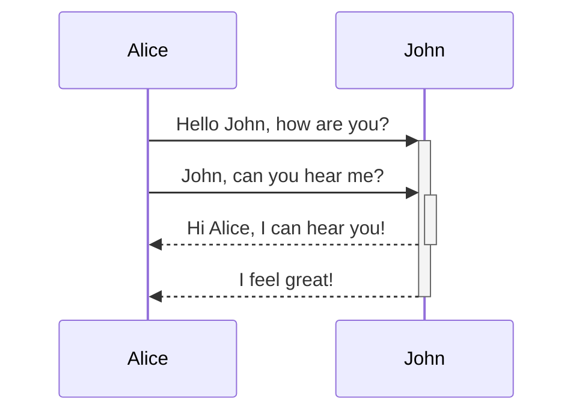

Simplified markup language, to add formatting to the text document. The text is stored in a plaintext file that has an `.md` or `.markdown` extension
# Why markdown
- Markdown is portable, and can be opened using any text application
- Platform independent
# How does it work?

Markdown applications use a _Markdown processor_ (parser) to convert the Markdown formatted text to a HTML output.
![[how-md-works.png]]

# Syntax
Note: We can directly use HTML inside markdown too.

# Headings
h1 ->  \# 
h2 -> \##
h3 -> \###
h4 -> \####
h5 -> \#####
h6 -> \######

# Formatting
**Italics:** 
Surround the word(s) with \_\(word1 word2)\_ {Single Underscore}
_Margareitie, italics is working_

**Bold:**
Surround the word(s) with \*\*(word1 word2)\*\* or \_\_(word1 word2)\_\_ {Double star or Double underscore}
**Bold is working**

**Strikethrough:**
They are widely supported but not standard.
Surround the word(s) by two ~ at start and end. \~\~word1 word2 \~\~
If markdown engine doesn't support ~ syntax, then we can use HTML \<s>\</s>
~~This is stricken off~~

**Quotes:**
We use \> to signify the line is a quote. Use \<cite>\</cite> tag in conjunction to signify the author of the quote.
>> You miss 100% of the shots you don't take
>><cite>Wayne Gretzky</cite>
> <cite>Micheal Scott</cite>

# Line breaks
To create soft line breaks, add two spaces at the end of the line.
To create hard line breaks, to signify end of paragraph, we use line-break enter.

**Code**
**Incline Code**
Use backticks to format code within a sentence.

**Code Blocks**
Use \`\`\`language code \`\`\` to write code with syntax highlighting.

[Language Codes](https://prismjs.com/#supported-languages)

- sh
- jsx
- tsx
- sql
- ts
- yaml
- jsstacktrace
- json
- http
- git
- docker
- go
- go-mod
- graphql

# Links
**Inline Link** 
Parenthesis are needed here, its the syntax of markdown
\[\What the user sees\]\(\www.xyz.com)

**Reference Link**
The link is actually a reference to another place in the document. Create a variable that holds the value as the link and use this variable in multiple places. So if we want to update, we need to update just in one area.

Link Definition, at bottom of file
\[\variableName]: \www.xyz.com (url or file path)

Link Consumption
\[What user sees]\[variableName]

# Images
Images work same as links, only difference is images are prefaced with !.

**Inline image links**
\!\[what user sees]\(link)

**Reference Image links**

Image Link Definition, at bottom of file
\[\variableName]: \www.xyz.com (url or file path)

Link Consumption
!\[What user sees]\[variableName]

# Lists

**Unordered List**
List that are not numbered, they are bullet points.
\* or \- are ways to generate a list
- Item1
- Item2

**Ordered List**
List that are numbered.
\1. ways to generate list
1. Item1
2. Item2

Note: Lists can be nested also
- Item 1
	1. Sub item1
	2. Sub item2
- Item2
- Item3

# Tables
Used to display data in tabular format. Tables are created using table using vertical bars (`|`) and hyphens (`-`)

| Col1 | Col2 | Col3 |
| :--: | ---- | ---- |
|      |      |      |
# Diagrams
Diagrams can be made using mermaid or excali-draw

